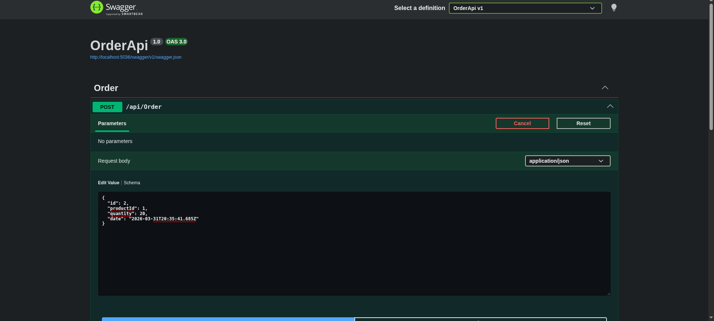

📧 Email Messaging Service

An asynchronous email messaging system built with .NET and RabbitMQ . This project demonstrates how to decouple services using a message broker, ensuring scalability, reliability, and efficient background processing.

Messages are published to a queue and processed by a consumer service responsible for sending emails, allowing the main application to remain fast and responsive.

🚀 Tech Stack
 - .NET
 - RabbitMQ
 - Message Queues

